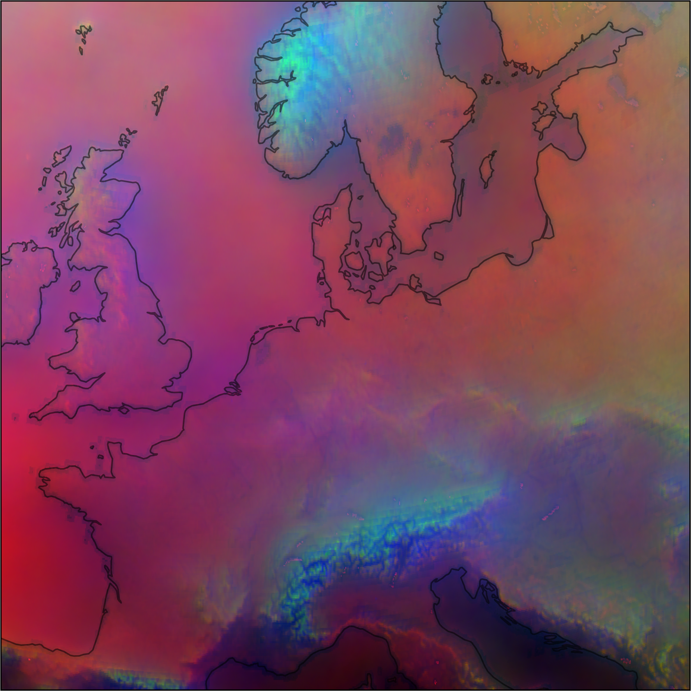

# CloudCast Stats (full_cropped, 768x768)

Based on reading the contents of the full_cropped CloudCast dataset.

CloudCast defines 10 cloud type results, which can be merged to get a set of low, mid and high cloud time-occurence maps.
```python
CCAST_CTYPES = {0: "No Cloud",
                1: "Very Low Cloud",
                2: "Low Cloud",
                3: "Mid-level Cloud",
                4: "High Opaque Cloud",
                5: "Very High Opaque Cloud",
                6: "Fractional Cloud",
                7: "High Semitransparent Thin Cloud",
                8: "High Semitransparent Moderately Thick Cloud",
                9: "High Semitransparent Thick Cloud",
                10: "High Semitransparent above Low/Medium Cloud"}

CCAST_CTYPES_Z = {"No and Fractional Cloud": (0, 6),
                  "Low Cloud": (1, 2),
                  "Mid Cloud": (3,),
                  "High Cloud": (4, 5, 7, 8, 9, 10)}
```

    Time Occurrence/Frequency
        No and Fractional Cloud     Min    9.34051%     Mean   34.97845%    Max   67.87932%
        Low Cloud                   Min    5.53692%     Mean   25.37808%    Max   45.81590%
        Mid Cloud                   Min    3.50805%     Mean   11.39559%    Max   31.93364%
        High Cloud                  Min   20.09595%     Mean   28.24690%    Max   41.37695%

[Low Cloud Occurence ](./images/ccast_freq_map_z_01.png)
[Mid Cloud Occurence ](./images/ccast_freq_map_z_02.png)
[High Cloud Occurence ](./images/ccast_freq_map_z_03.png)

These can be mapped to 0-1 and then used as RGB additive color model intensities; here Low Cloud == Red, Mid Cloud == Green and High Cloud == Blue). This gives tuples like [0.7294, 0.5137, 0.5764] or if converted to 0-255 [186, 131, 147] for each grid in the map.

[Low Cloud Occurence ](./images/ccast_freq_map_z_R.png)
[Mid Cloud Occurence ](./images/ccast_freq_map_z_G.png)
[High Cloud Occurence ](./images/ccast_freq_map_z_B.png)

This can be stacked/combined to get an RGB composite.
```python
rgb_normalized = np.dstack((red_normalized, green_normalized, blue_normalized))
```
Which shows that high- and mid-cloud is the dominate cloud type over high topography (i.e., could be snow/ice contamination), which low cloud is common elsewhere, except of the Mediterranean which all cloud is uncommon. This image could also of course be shown as a greyscale, in which case it just documents cloud occurence.

[RGB Cloud Occurence ](./images/ccast_freq_map_z_RGB.png)
