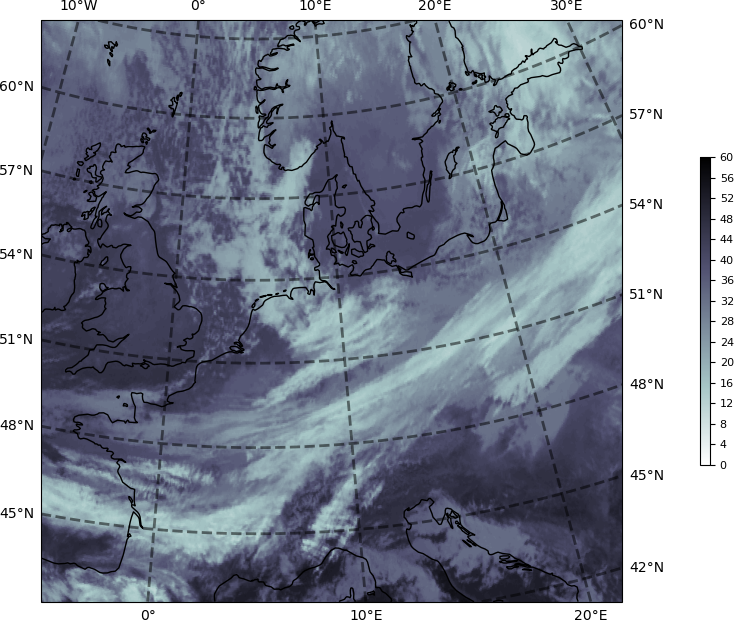
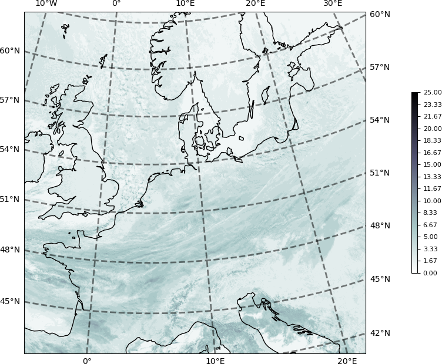
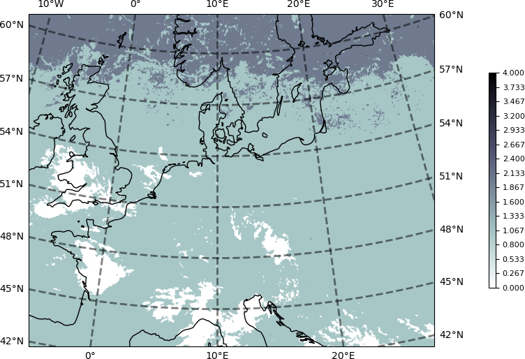
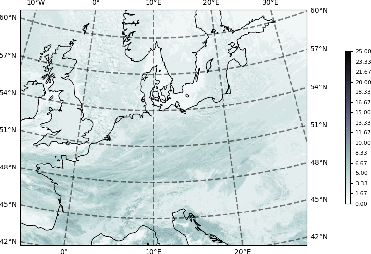

### Initial Setup

See setup.py to install the `cloudcast` package (or after adding any new modules).

```shell
    $ cd ~/myDev/cloudcast

    Mac:
        $ conda env export > environment.yml
        # Edit to remove references to things like pystare
        $ python -m pip install -e .
        $ pip install --editable .

    Linux:
        $ pip freeze > requirements.txt
        # Edit to remove references to things like pystare
        $ python setup.py build_ext --inplace
        $ pip install --editable .

    FlexFS:
        SSH into a Bayesics FlexFS server
        $ cd ~/.ssh; ssh-add <bayesics key>; cd ~/myDev/cloudcast
        $ ssh bayesics/bayesics1/bayesicsf/bayesics2
```

## MSG

### Meteosat Second Generation (MSG) level 1.5 (sourced from Müller et al. 2019, Schmetz et al. 2002)

#### Full Disk
MSG data is provided as Full Disk (geostationary), meaning that roughly the complete North-South extent of the globe from the Atlantic to the Indian Ocean is present in each file. See FIG. 3 in Schmetz et al. (2002) and Figure 6 in Müller et al. 2019.


The image projection being applied nominally is the Normalized Geostationary Projection (GEOS) as per (see Coordination Group for Meteorological Satellites), centered on 0 deg longitude, as this introduces the least distortions in the Level 1.5 image.

    +proj=geos +h=42164000.0 +R=6378000.0 +lon_0=0 +sweep=y

In this projection, the projected coordinates are scanning angles measured from the satellite looking directly downward, multiplied by the height of the satellite.

MSG data nominal position id at 0 deg lon and approximately +/-90 deg latitude

* Spatial sampling distance of 3 km for the IR 11 channels.
* The full disk image has 3712 x 3712 pixels (N-S by E-W).
* A geostationary projection center (0 deg longitude, 0 deg latitude) coincides with the middle of the pixel that has the line and column number (1856, 1856). Where the pixel numbering starts in the South-Eastern corner of the image with line and column number (1,1).

Reading from a .nat file you'll find a list of longitudes and latitudes ranging in value.

    lons (3712, 3712) (10280792): [-81.12566375732422, ... 81.12566375732422]
    lats (3712, 3712) (10280792): [-81.0744857788086, ... 81.0744857788086]

However, you will find that the Geostationary Projection can't show all of this. This is because there are lots of missing data values with valid lon/lat entries. If you limit the lon/lat to where valid data are found you'll get something more like 50104766 rather than 50524714 entries (1D)

    lons (10213685): [-75.26545715332031 ... 75.56462097167969]
    lats (10213685): [-78.95874786376953 ... 78.29975891113281]

**An important** aspect to keep in mind here is this full disk view does not use interpolation, only re-projection of point to lat/lon.


#### Partial Disk

A high-resolution visible (HRV) channel has a 1-km spatial sampling distance. HRV covers only half the E–W direction of the Full Disk with 11136 x 5568 pixels (N-S by E-W). For the HRV image, the nominal geostationary position is the middle of the HRV-pixel with the line and column number (5566, 5566) relative to the Full Disk datagrid.

The registration of HRV and non-HRV pixels is done in such a way that the HRV pixel lies at the center of the pixel of the other channels.


Here I plotted the data from a .nat file. Note where these images are white, but look from the above images to be within the valid data domain, there is either no cloud or no data reported.

**An important** aspect to keep in mind here is like the full disk view, partial disk view the does not use interpolation, only re-projection of point to lat/lon.


----

#### What the docs say

##### Nielsen et al. (2021) "CloudCast: A Satellite-Based Dataset and Baseline for Forecasting Clouds"

    "we start by collecting the 70 080 raw multispectral satellite images from EUMETSAT. These images come from a
    satellite constellation in geostationary orbit centered at zero degrees longitude and arrive in 15-min intervals.
    The resolution is 3712 × 3712 pixels for the full-disk of the Earth, which implies that every pixel corresponds
    to a space of dimensions 3 × 3 km."
    [Mike's Take: This sounds like they are using the full- and partial-disk data directly.]

    "we sample one visible channel, two infrared channels, and one water vapor channel for each observation
    to enable multilayer cloud detection."

    "As a final postprocessing step, we interpolate missing observations that can arise due to numerous reasons
    such as scheduled outages or sun outages. More specifically, we interpolate the missing observations from
    neighboring values linearly, which only happens for short-term periods (below 6 h)."

    "In addition to the raw dataset, we also publish a standardized version for future studies, where we center and
    project the final annotated dataset to cover Central Europe, which implies a final resolution of 728 × 728 pixels."
    [Mike's Take: So the results/classifications are on 728x728.]

##### CloudCast Tutorial
    This is linked to form Nielsen et al. (2021)

    "The CloudCast dataset contains 70080 images with 11 different cloud types for multiple layers of the atmosphere
    annotated on a pixel level. The dataset has a spatial resolution of 928 x 1530 pixels recorded with 15-min intervals
    for the period 2017-2018, where each pixel represents an area of 3 × 3 km."
    [Mike's Take: This counterdicts Nielsen et al. (2021) who say they use the full- and partial-disk data,
     although they point to this tutorial.]

    "To enable standardized datasets for benchmarking computer vision methods, we include a full-resolution dataset
    centered and projected dataset over Europe (728 × 728)."
    [Mike's Take: like the results/classifications from Nielsen et al. (2021)]

    [Mike's Take: What odd is the CloudCast Tutorial itself doesn't use 728 × 728 results resolution it talks about,
        but 768 × 768. No where in the CloudCast Tutorial code is the 928 x 1530 resolution used.]

##### CloudCast Github
    This was linked to from Partio et al. (2024), which is a similar, but not identical to  Nielsen et al. (2021).

    "The geographical domain is that of MEPS (MEPS25D MEPS2500D):
        northern europe in lambert conformal conic projection, 2.5 km grid."
    [Mike's Take: ]

##### Partio et al. (2024) "CloudCast -- Total Cloud Cover Nowcasting with Machine Learning."

    "MetCoOp Ensemble Prediction System (MEPS)."
    "MEPS forecast is produced ... with a horizontal resolution of 2.5km."
    "The data was reprojected to lambert conformal conic projection matching the domain of interest,
        and converted to grib file format. This geographical domain is located between 50 deg N and 75 deg N,
        20 deg W and 45 deg E, as seen in Figure 1. The horizontal resolution of the data after reprojection was 4 km."


    [Mike's Take: Partio et al. (2024) don't refer to the number of grids this MEPS domain contains, but they do
     point to the CloudCast github that includes the following:]

    From cloudcast repo latlonraster() in cloudcast/base/plotutils.py
        img_size = (768, 768)
        x = np.linspace(-1065644.490, 1306855.478, 768)
        y = np.linspace(9683729.573, 7011229.349, 768)

    [Mike's Take: It is unclear if this is the "data was reprojected to lambert conformal conic projection" referred
    to above or for the 728×728 results/classifications like with Nielsen et al. (2021). Or the confusing
    728 × 728 results resolution the CloudCast Tutorial talks about, but the code says 768 × 768 like above. ]

****

Following the CloudCast Tutorial: CloudCast Stereographic (768, 768) based on reprojection and interpolation .

Here is the domain.


<!--  -->

Here we show the associated data.





<!-- Here the data projected to Sterographic are reprojected to Lambert Conformal.




 -->
----

### Mike's Take

The quote "spatial resolution of 928 x 1530 pixels .... where each pixel represents an area of 3×3 km." suggests a simple subset of the non-HRV MSG data.

I assume the longitude subset of 928 rows starts from the northern most row.

    (928*3)/111 = 25.081 deg lat giving 81.1257 - 25.081 = 56.0447.

So 81N to 56N, or using valid data lats

    78.2998 - 25.081 = 53.2188

or 78N to 53N, which is close to 75N to 50N used by Partio et al. (2024).

20W and 45E


Note: the "full_cropped" CloudCast results has the 768x768 resolution. The coordinates are given in projected coordinates not lon/lat.
```
File "2017M01.nc"
File type: Hierarchical Data Format, version 5

netcdf /Users/mbauer/tmp/CloudCast/full_cropped_cloud/2017M01.nc {
  dimensions:
    lat = 768;
    lon = 768;
    time = 2976;
  variables:
    double lat(lat=768);
      :_FillValue = NaN; // double

    double lon(lon=768);
      :_FillValue = NaN; // double

    long time(time=2976);
      :calendar = "proleptic_gregorian";
      :units = "minutes since 2017-01-01 00:09:17";

    ubyte __xarray_dataarray_variable__(lat=768, lon=768, time=2976);

  // global attributes:
}
```


### CloudCast
The dataset has a spatial resolution of 928 x 1530 pixels recorded with 15-min intervals for the period 2017-2018, where each pixel represents an area of 3×3 km.


### References

    CloudCast Github
        https://github.com/fmidev/cloudcast

    CloudCast Tutorial
        https://github.com/holmdk/CloudCast_Dataset/blob/main/CloudCast_Tutorial.ipynb

    EUMETSAT, "Cloud analysis image: EUM/TSS/MAN/15/ 795729, no. v1C, 2015. Product Product guide"

    EUMETSAT, "Cloud analysis product: EUM/TSS/MAN/15/ 804415, no. v1B, 2015. Product Product guide"

    Coordination Group for Meteorological Satellites: LRIT/HRIT Global Specification, Issue 2.6, August 1999.

    A. H. Nielsen, A. Iosifidis and H. Karstoft, "CloudCast: A Satellite-Based Dataset and Baseline for Forecasting Clouds,"
        in IEEE Journal of Selected Topics in Applied Earth Observations and Remote Sensing, vol. 14, pp. 3485-3494, 2021,
        doi: 10.1109/JSTARS.2021.3062936.

    J. Müller, G. Fowler, K. Dammann, C. Rogers, Y. Buhler, and J. Flewin, "MSG level 1.5 image data format description,"
        EUM/MSG/ICD/105, vol. 31, no. v8, 2017, Accessed: Jun. 13, 2019.
        Available: https: //www-cdn.eumetsat.int/files/2020-05/pdf ten 05105 msg img data.pdf

    Partio, Mikko & Hieta, Leila & Kokkonen, Anniina. (2024).
        "CloudCast -- Total Cloud Cover Nowcasting with Machine Learning." 10.48550/arXiv.2410.21329.

    Reprojecting images from a Geostationary projection
        https://scitools.org.uk/cartopy/docs/v0.15/examples/geostationary.html

    Schmetz, J., P. Pili, S. Tjemkes, D. Just, J. Kerkmann, S. Rota, and A. Ratier, 2002:
        AN INTRODUCTION TO METEOSAT SECOND GENERATION (MSG). Bull. Amer. Meteor. Soc., 83,
        977–992, https://doi.org/10.1175/1520-0477(2002)083<0977:AITMSG>2.3.CO;2.

    Schmetz, Johannes et al. "Supplement to An Introduction to Meteosat Second Generation (MSG)."
        Bull. Amer. Meteor. Soc., 83 (2002): 991-991.

    Schmetz, Johannes et al. :Supplement to An Introduction to Meteosat Second Generation (MSG): SEVIRI CALIBRATION."
        Bull. Amer. Meteor. Soc., 83 (2002): 992-992.

    Schmetz, Johannes & Woick, H & Tjemkes, Stephen & Rattenborg, M & Kerkmann, J. (2011).
        "METEOSAT SECOND GENERATION (MSG): IMAGE DATA AND PRODUCTS.""
