### Initial Setup

See setup.py to install the `cloudcast` package (or after adding any new modules).

```shell
    $ cd ~/myDev/cloudcast

    Mac:
        $ conda env export > environment.yml
        # Edit to remove references to things like pystare
        $ python -m pip install -e .
        $ pip install --editable .

    Linux:
        $ pip freeze > requirements.txt
        # Edit to remove references to things like pystare
        $ python setup.py build_ext --inplace
        $ pip install --editable .

    FlexFS:
        SSH into a Bayesics FlexFS server
        $ cd ~/.ssh; ssh-add <bayesics key>; cd ~/myDev/cloudcast
        $ ssh bayesics/bayesics1/bayesicsf/bayesics2
```

## MSG

### Meteosat Second Generation (MSG) level 1.5 (sourced from Müller et al. 2019, Schmetz et al. 2002)

#### Full-Disk (IR Channels)
[>MSG] is an abbreviation.  So is [>(MSG) Markdown].

MSG data is provided as full-disk (geostationary), meaning that roughly the complete North-South extent of the globe from the Atlantic to the Indian Ocean is present in each file. See FIG. 3 in Schmetz et al. (2002) and Figure 6 in Müller et al. 2019.

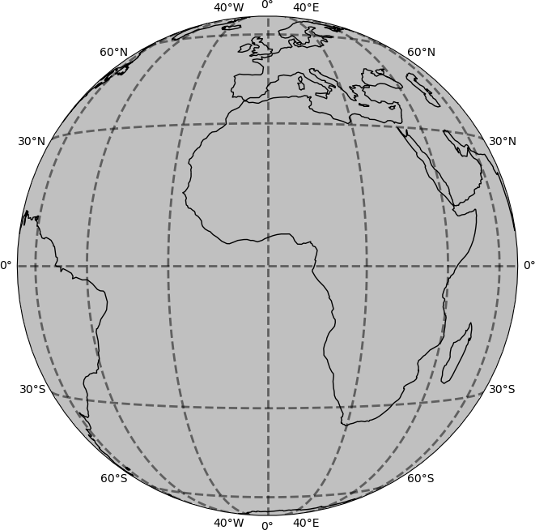

The image projection being applied nominally is the Normalized Geostationary Projection (GEOS) as per (see Coordination Group for Meteorological Satellites), centered on 0 deg longitude, as this introduces the least distortions in the Level 1.5 image.

    +proj=geos +h=42164000.0 +R=6378000.0 +lon_0=0 +sweep=y

In this projection, the projected coordinates are scanning angles measured from the satellite looking directly downward, multiplied by the height of the satellite.

MSG data nominal position id at 0 deg lon and approximately +/-90 deg latitude

* Spatial sampling distance of 3 km for the IR 11 channels.
* The full-disk image has 3712 x 3712 pixels (N-S by E-W).
* A geostationary projection center (0 deg longitude, 0 deg latitude) coincides with the middle of the pixel that has the line and column number (1856, 1856). Where the pixel numbering starts in the South-Eastern corner of the image with line and column number (1,1).

Reading from a .nat file you'll find a list of longitudes and latitudes ranging in value (raw file input, IR_087 channel).

    lons      (3712, 3712) (10280792): [-81.126, ... 81.126]
    lats      (3712, 3712) (10280792): [-81.075, ... 81.075]
    data_vals (3712, 3712) (10213685): [2.155,   ... 68.442]

However, you will find that the Geostationary Projection can't show all of this. This is because there are lots of missing data values with valid lon/lat entries. If you limit the lon/lat to where valid data ($\ge 0$) are found you'll get something more like 10213685 rather than 10280792 entries (1D, 99.4% of all grids)

    lons (10213685): [-75.266 ... 75.565]
    lats (10213685): [-78.959 ... 78.230]

Note that there is no difference if we exclude zero valued grids ($\gt 0$). In this case any way. As we will see below this is not the case with the visiable channel.

**An important** aspect to keep in mind here is this full-disk view does not use interpolation, only re-projection of point to lat/lon. These data points can be easily reprojected to other formats, here only valid data grids are shaded.

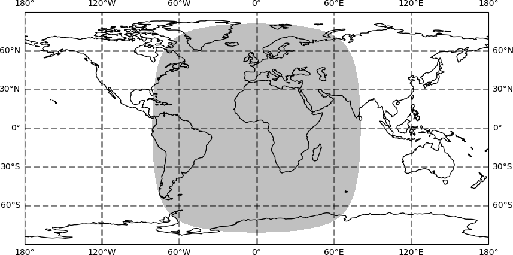

#### Partial-Disk (VIS Channel)

A high-resolution visible (HRV) channel has a 1-km spatial sampling distance. HRV covers only half the E–W direction of the full-disk with 11136 x 5568 pixels (N-S by E-W). For the HRV image, the nominal geostationary position is the middle of the HRV-pixel with the line and column number (5566, 5566) relative to the full-disk datagrid.

The registration of HRV and non-HRV pixels is done in such a way that the HRV pixel lies at the center of the pixel of the other channels.

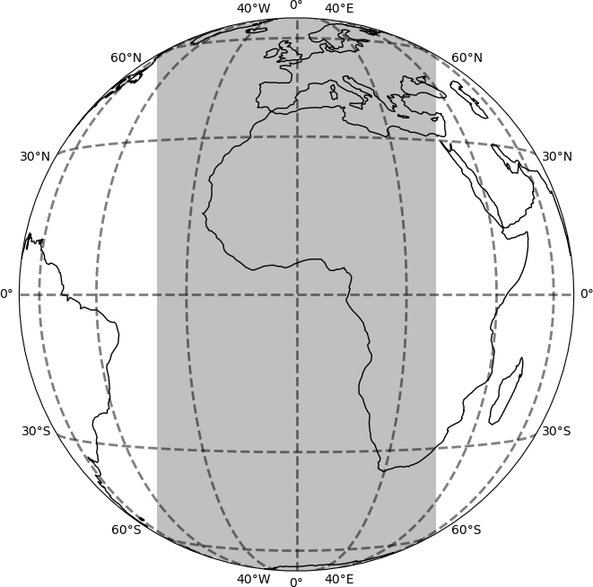

As before, reading from a .nat file you'll find a list of longitudes and latitudes ranging in value (raw file input).

    lons      (11136, 5568) (50498347): [-65.736, ... 81.220]
    lats      (11136, 5568) (50498347): [-81.136, ... 81.136]
    data_vals (11136, 5568) (50129989): [0.0,     ... 27.711]

Likewise, you will find that the Geostationary Projection can't show all of this. This is because there are lots of missing data values with valid lon/lat entries. If you limit the lon/lat to where valid data ($\ge 0$) are found you'll get something more like 50129989 rather than 50498347 entries (1D, 99.2% of all grids)

    lons (50129989): [-58.130  ... 75.565]
    lats (50129989): [-78.960  ... 78.301]

If we exclude zero valued grids ($\gt 0$), we find far fewer 'valid' values (31.2% of all grids). In this case anyway.

    lons (15736845): [-58.049  ... 75.565]
    lats (15736845): [-78.960  ... 78.294]

**An important** aspect to keep in mind here is like the full-disk view, partial-disk view the does not use interpolation, only re-projection of point to lat/lon.

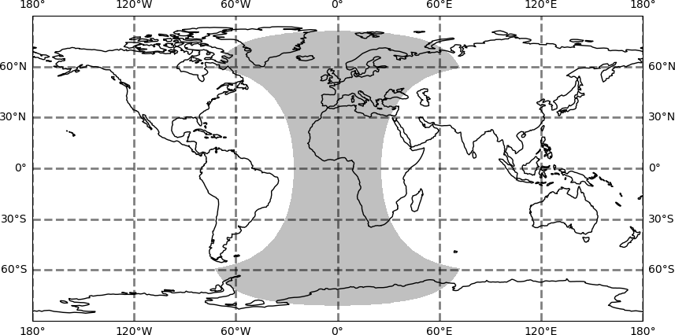

----

Next, I plotted the data from a .nat file. Note where these images are white, but look from the above images to be within the valid data domain, there is either no cloud or no data reported.

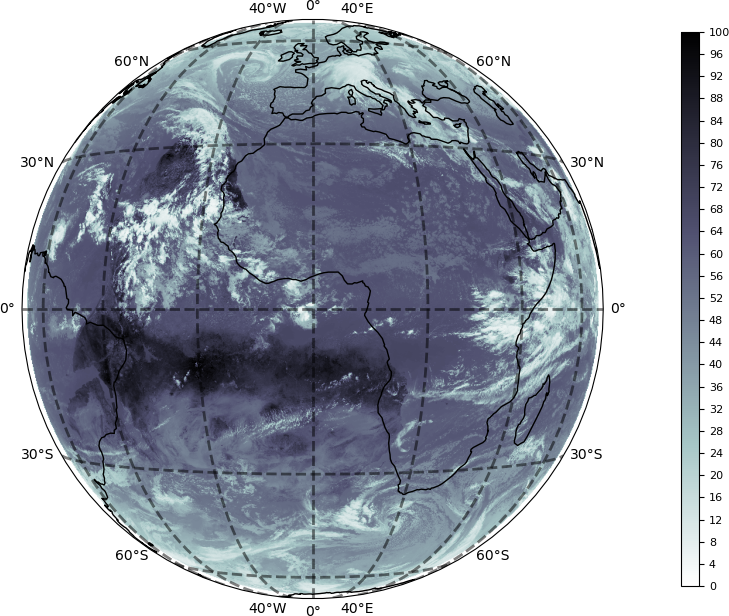

<!-- 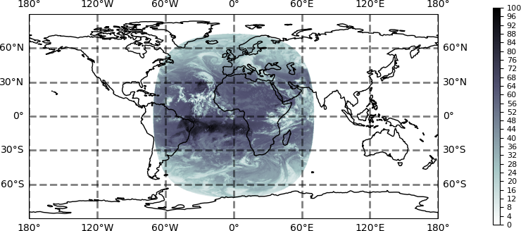 -->

We can also see very clearly the asysmetry of non-zero data between the IR and VIS channel.

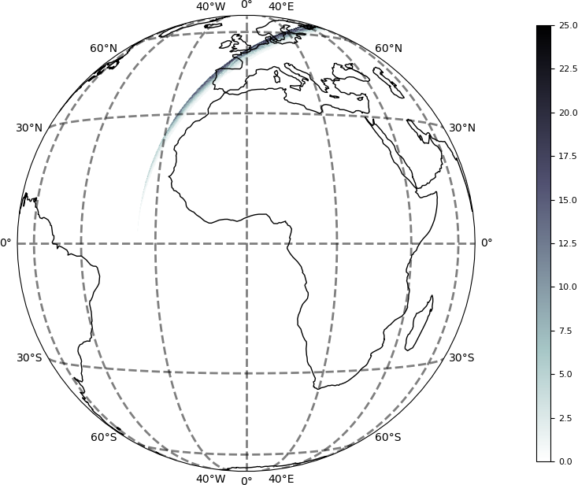

<!-- 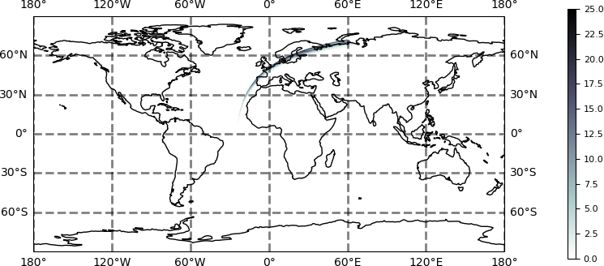 -->

Note below is the VIS channel for another time to show the variablity of this channel in terms of coverage.

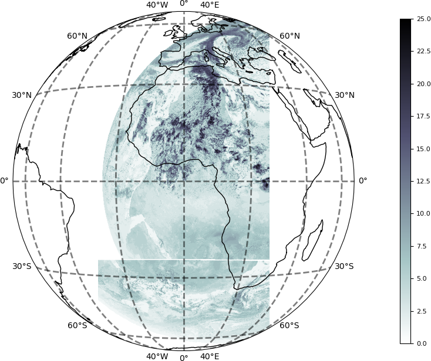

<!-- 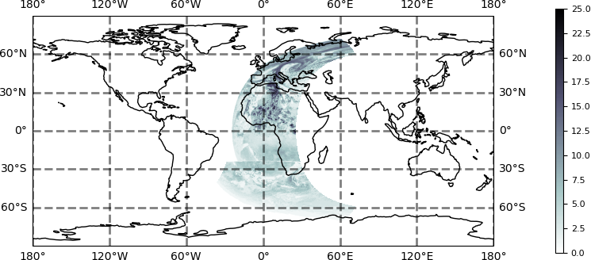 -->

----

#### What the docs say

##### Nielsen et al. (2021) "CloudCast: A Satellite-Based Dataset and Baseline for Forecasting Clouds"

    "we start by collecting the 70 080 raw multispectral satellite images from EUMETSAT. These images come from a
    satellite constellation in geostationary orbit centered at zero degrees longitude and arrive in 15-min intervals.
    The resolution is 3712 × 3712 pixels for the full-disk of the Earth, which implies that every pixel corresponds
    to a space of dimensions 3 × 3 km."
    [Mike's Take: This sounds like they are using the full- and partial-disk data directly. That is, no interpolation or subsetting.]

    "As a final postprocessing step, we interpolate missing observations that can arise due to numerous reasons
    such as scheduled outages or sun outages. More specifically, we interpolate the missing observations from
    neighboring values linearly, which only happens for short-term periods (below 6 h)."

    "In addition to the raw dataset, we also publish a standardized version for future studies, where we center and
    project the final annotated dataset to cover Central Europe, which implies a final resolution of 728 × 728 pixels."
    [Mike's Take: So the results/classifications are on 728 x 728.]

##### CloudCast Tutorial
    This is linked to form Nielsen et al. (2021)

    "The CloudCast dataset contains 70080 images with 11 different cloud types for multiple layers of the atmosphere
    annotated on a pixel level. The dataset has a spatial resolution of 928 x 1530 pixels recorded with 15-min intervals
    for the period 2017-2018, where each pixel represents an area of 3 × 3 km."
    [Mike's Take: This counterdicts Nielsen et al. (2021) who say they use the full- and partial-disk data,
     although they point to this tutorial.]

    "To enable standardized datasets for benchmarking computer vision methods, we include a full-resolution dataset
    centered and projected dataset over Europe (728 × 728)."
    [Mike's Take: like the results/classifications from Nielsen et al. (2021)]

    [Mike's Take: What odd is the CloudCast Tutorial itself doesn't use 728 × 728 results resolution it talks about,
        but 768 × 768. Nowhere in the CloudCast Tutorial code is the 928 x 1530 resolution used.]

##### CloudCast Github
    This was linked to from Partio et al. (2024), which is a similar, but not identical to  Nielsen et al. (2021).

    "The geographical domain is that of MEPS (MEPS25D MEPS2500D):
        northern europe in lambert conformal conic projection, 2.5 km grid."

##### Partio et al. (2024) "CloudCast -- Total Cloud Cover Nowcasting with Machine Learning."

    "MetCoOp Ensemble Prediction System (MEPS)."
    "MEPS forecast is produced ... with a horizontal resolution of 2.5km."
    "The data was reprojected to lambert conformal conic projection matching the domain of interest,
        and converted to grib file format. This geographical domain is located between 50 deg N and 75 deg N,
        20 deg W and 45 deg E, as seen in Figure 1. The horizontal resolution of the data after reprojection was 4 km."

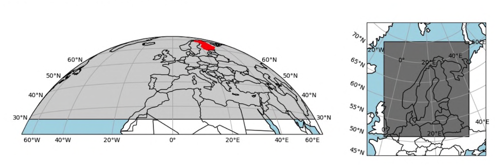

    [Mike's Take: Partio et al. (2024) don't refer to the number of grids this MEPS domain contains, but they do
     point to the CloudCast github that includes the following:]

    From cloudcast repo latlonraster() in cloudcast/base/plotutils.py
        img_size = (768, 768)
        x = np.linspace(-1065644.490, 1306855.478, 768)
        y = np.linspace(9683729.573, 7011229.349, 768)

    [Mike's Take: It is unclear if this is the "data was reprojected to lambert conformal conic projection" referred
    to above or for the 728 × 728 results/classifications like with Nielsen et al. (2021). Or the confusing
    728 × 728 results resolution the CloudCast Tutorial talks about, but the code says 768 × 768 like above.]

### CloudCast

Following the CloudCast Tutorial, we see the "full_cropped_cloud" data takes on a Stereographic (768 x 768) based on reprojection and interpolation from the Geostationary source MSG data. Moreover, looking at a CloudCast datafile "full_cropped_cloud/2017M01.nc" we see that the array has the dimentions of `(lat: 768, lon: 768, time: 2976)`, suggesting fixed lon/lat grid, which is not what simply sampling the MSG data would give.

Here is the resulting domain.

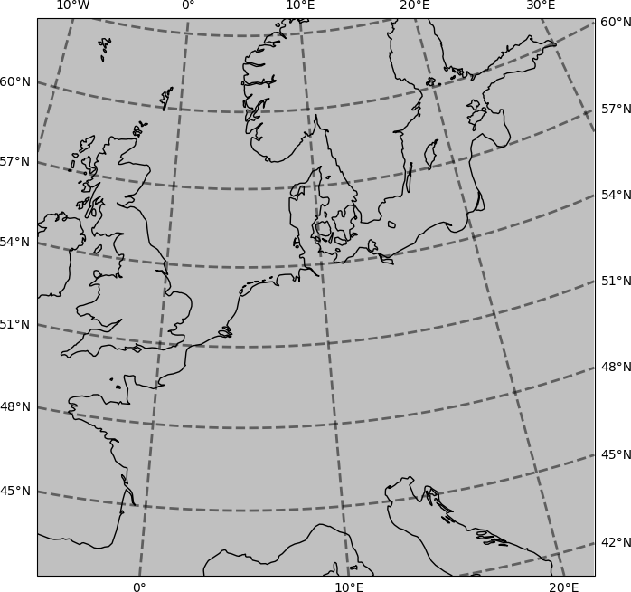

Below is the summary "full_cropped_cloud" cloud-type occurence RGB.

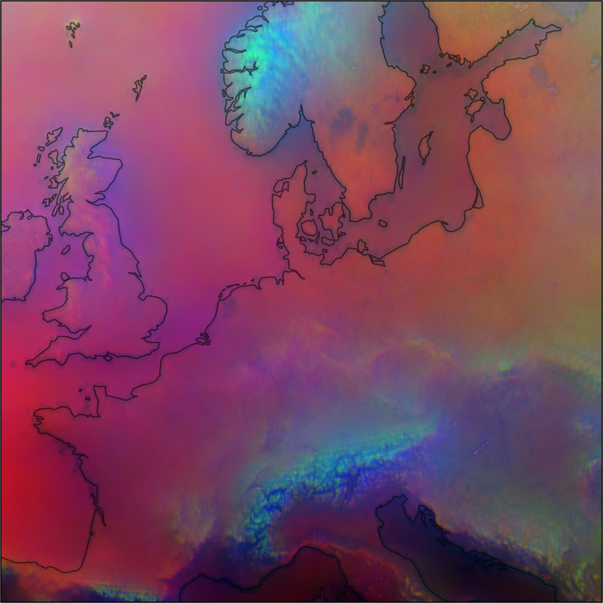

<!-- 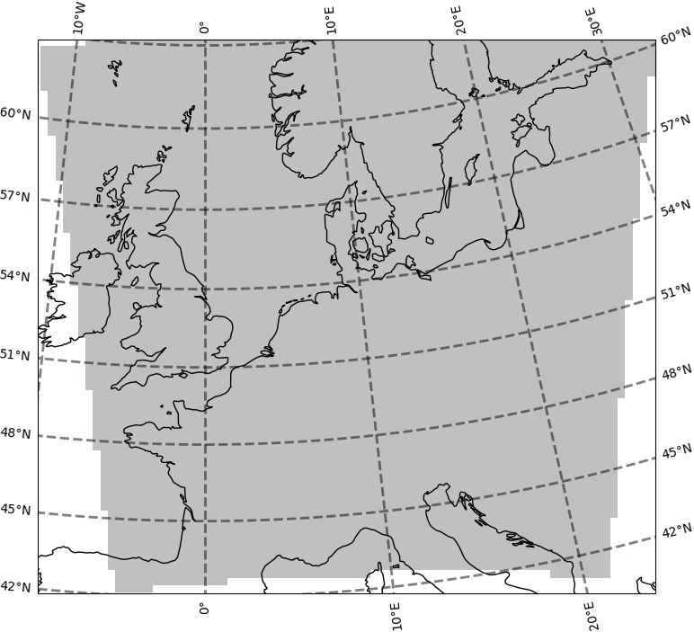 -->
\
In comparison, the "full_raw_cloud" dataset lists lat and lon as 928 x 1530 2D arrays (as expected).

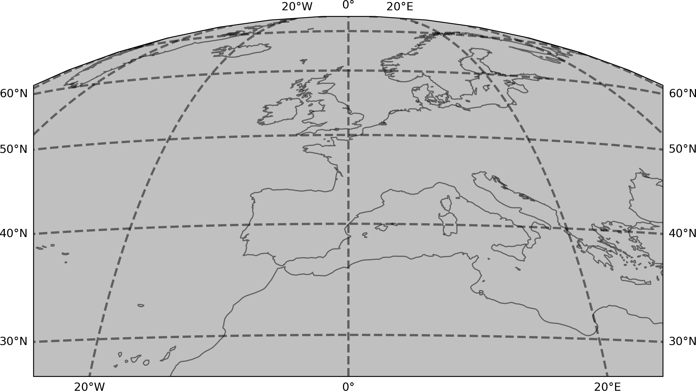

Below is the summary "full_raw_cloud" cloud-type occurence RGB.

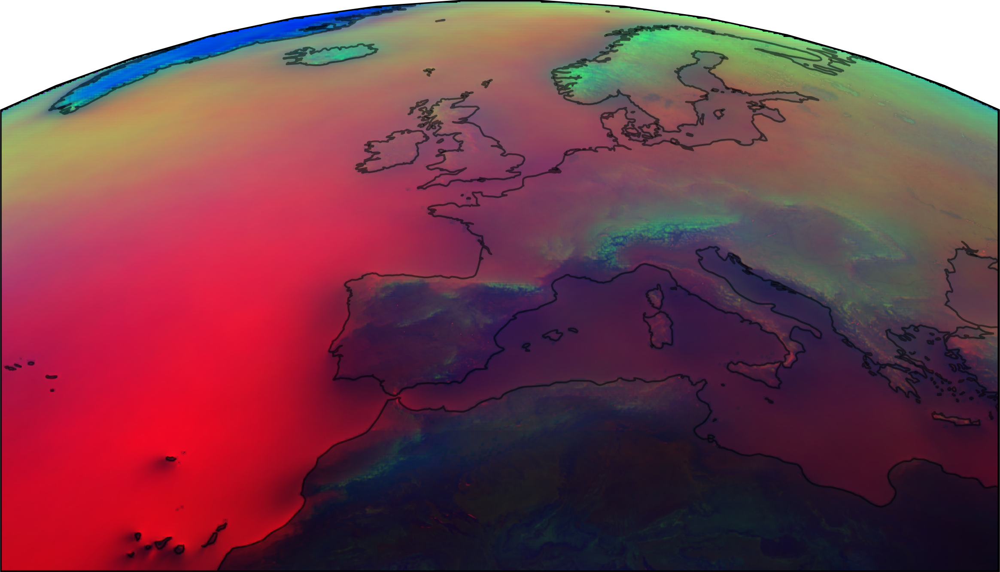

Our goal is to make a 928 x 1530 subset of an 3712 × 3712 MSG data for comparison. Starting with the '.nat' MSG files.

```
The base cloudcast MSG channels are ["VIS006", "IR_039", "IR_108", "IR_120"] marked "*" below

    DataID(name='HRV',    wavelength=WavelengthRange(min=0.5,  central=0.7,   max=0.9,  unit='µm'), resolution=1000.134348869, calibration=<calibration.reflectance>,            modifiers=())
    DataID(name='IR_016', wavelength=WavelengthRange(min=1.5,  central=1.64,  max=1.78, unit='µm'), resolution=3000.403165817, calibration=<calibration.reflectance>,            modifiers=())
*   DataID(name='IR_039', wavelength=WavelengthRange(min=3.48, central=3.92,  max=4.36, unit='µm'), resolution=3000.403165817, calibration=<calibration.brightness_temperature>, modifiers=())
    DataID(name='IR_087', wavelength=WavelengthRange(min=8.3,  central=8.7,   max=9.1,  unit='µm'), resolution=3000.403165817, calibration=<calibration.brightness_temperature>, modifiers=())
    DataID(name='IR_097', wavelength=WavelengthRange(min=9.38, central=9.66,  max=9.94, unit='µm'), resolution=3000.403165817, calibration=<calibration.brightness_temperature>, modifiers=())
*   DataID(name='IR_108', wavelength=WavelengthRange(min=9.8,  central=10.8,  max=11.8, unit='µm'), resolution=3000.403165817, calibration=<calibration.brightness_temperature>, modifiers=())
*   DataID(name='IR_120', wavelength=WavelengthRange(min=11.0, central=12.0,  max=13.0, unit='µm'), resolution=3000.403165817, calibration=<calibration.brightness_temperature>, modifiers=())
    DataID(name='IR_134', wavelength=WavelengthRange(min=12.4, central=13.4,  max=14.4, unit='µm'), resolution=3000.403165817, calibration=<calibration.brightness_temperature>, modifiers=())
*   DataID(name='VIS006', wavelength=WavelengthRange(min=0.56, central=0.635, max=0.71, unit='µm'), resolution=3000.403165817, calibration=<calibration.reflectance>,            modifiers=())
    DataID(name='VIS008', wavelength=WavelengthRange(min=0.74, central=0.81,  max=0.88, unit='µm'), resolution=3000.403165817, calibration=<calibration.reflectance>,            modifiers=())
    DataID(name='WV_062', wavelength=WavelengthRange(min=5.35, central=6.25,  max=7.15, unit='µm'), resolution=3000.403165817, calibration=<calibration.brightness_temperature>, modifiers=())
    DataID(name='WV_073', wavelength=WavelengthRange(min=6.85, central=7.35,  max=7.85, unit='µm'), resolution=3000.403165817, calibration=<calibration.brightness_temperature>, modifiers=())
```

Note all of these channels are full-disk (3712 × 3712). That is, we don't need to mess with 'HRV' necessarily. So they can all be subseted as follows.
```python
##
# MSG subset (928, 1530) from (3712, 3712)
lons = lons[-928:, 1092:2622]
lats = lats[-928:, 1092:2622]
data_vals = data_vals[-928:, 1092:2622]
```

An oddity from the CloudCast Tutorial is the use of calibration = "radiance" when reading the files when from above it looks like "reflectance" and "brightness_temperature" should be used.
This explains why the below images have units differing from what I would expect from an IR channel datasets (i.e., Brightness Temperature in deg K).

These are based on `MSG3-SEVI-MSG15-0100-NA-20170102122740.989000000Z-NA.nat` or 2017-01-02 12:27 UTC.

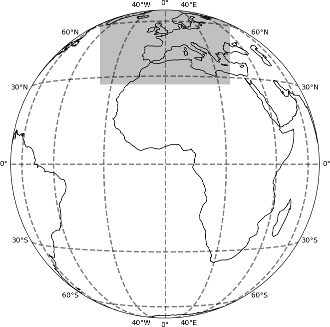

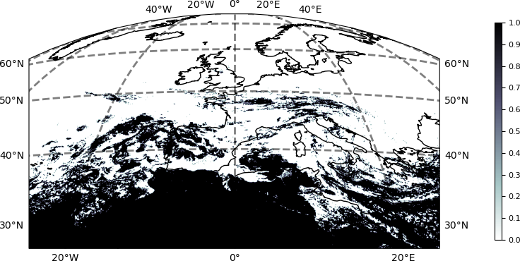

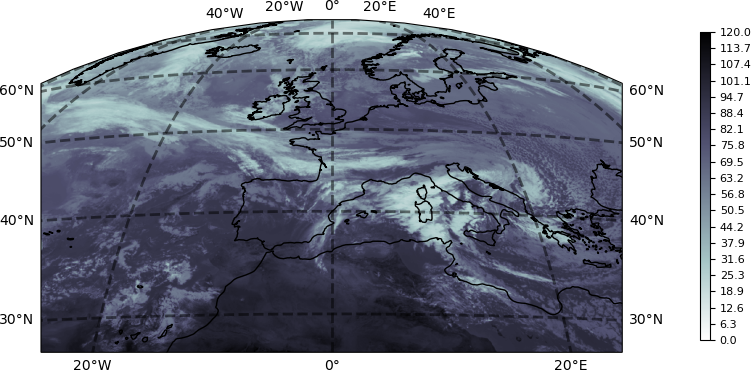


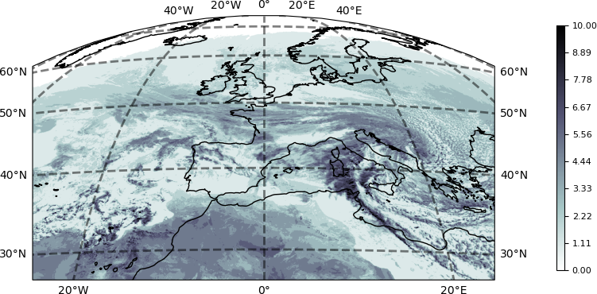

If instead of reading the ".nat" file and saving as a GTif, I just read the ".nat" file I can get "reflectance" and "brightness_temperature" values.

![Subset of MSG IR 3.92 $\mu$m Channel Brightness Temperature [K], 928 x 1530 Geostationary](./images/raw_IR_039_BT_Geostationary.png "CloudCast")

![Subset of MSG IR 10.8 $\mu$m Channel Brightness Temperature [K], 928 x 1530 Geostationary](./images/raw_IR_108_BT_Geostationary.png "CloudCast")

![Subset of MSG IR 12.0 $\mu$m Channel Brightness Temperature [K], 928 x 1530 Geostationary](./images/raw_IR_120_BT_Geostationary.png "CloudCast")

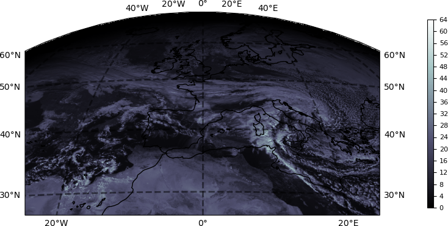


### Terms

**Meteosat Second Generation (MSG)**
:    A series of geostationary meteorological satellites operated by EUMETSAT under the Meteosat Transition Programme and the Meteosat Second Generation program.

**Infrared (IR) Channel**
:    Electromagnetic radiation with wavelengths longer than that of visible light but shorter than microwaves (750 nm to 1 mm).
:    IR is essentially heat energy.
:    The MSG satellites measure IR radiation which is emitted by the Earth and cloud based on their temperature (radiance).
:    These measurements occur over a range of wavelengths, called bands and/or channels.

**Radiance**
:    Energy emitted per unit time in a specified direction by a unit area of an emitting surface.
:    Spectral radiance or specific intensity is the radiance over a specific range of electromagnetic radiation wavelengths (i.e., a channel).
:    Spectral radiance has units of the watt per steradian (square radian, angle) per square meter per meter or $W sr^{−1} m^{−3}$.
:    Most commonly measured by IR channels.

**Brightness Temperature**
:    Also called radiance temperature.
:    A measure of the intensity of electromagnetic energy coming from a source (i.e., radiance).
:    The temperature at which a black-body would have to be in order to match the radiance over a specific range of electromagnetic radiation wavelengths (i.e., a channel).
:    Brightness temperature has units of degree Kelvin (K).

**Reflectance**
:    Similar idea as radiance, except related to electromagnetic radiation that is reflected (rather than emitted) by a surface.
:    Specifically, reflectance is the ratio of the amount of light leaving a target to the amount of light striking the target.
:    Generally measured for visiable channels.
:    Reflectance It has no units.

**Full-Disk**
:    MSG data is provided as a full-disk (geostationary), meaning that roughly the complete North-South extent of the globe from the Atlantic to the Indian Ocean is present in each file.
:    Spatial sampling distance of 3 km for 11 infrared (IR) channels.
:    The full-disk image has 3712 x 3712 pixels (N-S by E-W).

**Partial-Disk**
:    MSG data from the visible spectrum that is higher resolution than the Full-Disk data.
:    Spatial sampling distance of 1 km.
:    The partial-disk image has 11136 x 5568 pixels (N-S by E-W).

**Map Projection**
:     A broad set of mathematical transformations from 3D spherical coordinates (longitude, latitude, radial distance from center of Earth) to nonspherical (generally flat) 2D surface and Cartesian coordinates (often units of distance).

**CloudCast**
:    A cloud type/amount dataset based on analysis of MSG data.
:    CloudCast uses four MSG channels: One visible channel "VIS006" 0.56-0.71 $\mu m$, two IR channels "IR_039" 3.48-4.36 $\mu m$ and "IR_120" 11.0-13.0 $\mu m$, and one water vapor channel "IR_108" 9.8-11.8 $\mu m$.
:    CloudCast data come in 3 forms.
:     **Small** Dataset (128×128), which is downsampled from the cropped-dataset.
:     **Cropped** Full Dataset (768×768), which is projected and interpolated from the raw-dataset.
:     **Raw** Full Dataset (928×1530), a subset of the full-disk (3712x3712) MSG geostationary data.

### References

    CloudCast Github
        https://github.com/fmidev/cloudcast

    CloudCast Tutorial
        https://github.com/holmdk/CloudCast_Dataset/blob/main/CloudCast_Tutorial.ipynb

    EUMETSAT, "Cloud analysis image: EUM/TSS/MAN/15/ 795729, no. v1C, 2015. Product Product guide"

    EUMETSAT, "Cloud analysis product: EUM/TSS/MAN/15/ 804415, no. v1B, 2015. Product Product guide"

    Coordination Group for Meteorological Satellites: LRIT/HRIT Global Specification, Issue 2.6, August 1999.

    A. H. Nielsen, A. Iosifidis and H. Karstoft, "CloudCast: A Satellite-Based Dataset and Baseline for Forecasting Clouds,"
        in IEEE Journal of Selected Topics in Applied Earth Observations and Remote Sensing, vol. 14, pp. 3485-3494, 2021,
        doi: 10.1109/JSTARS.2021.3062936.

    J. Müller, G. Fowler, K. Dammann, C. Rogers, Y. Buhler, and J. Flewin, "MSG level 1.5 image data format description,"
        EUM/MSG/ICD/105, vol. 31, no. v8, 2017, Accessed: Jun. 13, 2019.
        Available: https: //www-cdn.eumetsat.int/files/2020-05/pdf ten 05105 msg img data.pdf

    Partio, Mikko & Hieta, Leila & Kokkonen, Anniina. (2024).
        "CloudCast -- Total Cloud Cover Nowcasting with Machine Learning." 10.48550/arXiv.2410.21329.

    Reprojecting images from a Geostationary projection
        https://scitools.org.uk/cartopy/docs/v0.15/examples/geostationary.html

    Schmetz, J., P. Pili, S. Tjemkes, D. Just, J. Kerkmann, S. Rota, and A. Ratier, 2002:
        AN INTRODUCTION TO METEOSAT SECOND GENERATION (MSG). Bull. Amer. Meteor. Soc., 83,
        977–992, https://doi.org/10.1175/1520-0477(2002)083<0977:AITMSG>2.3.CO;2.

    Schmetz, Johannes et al. "Supplement to An Introduction to Meteosat Second Generation (MSG)."
        Bull. Amer. Meteor. Soc., 83 (2002): 991-991.

    Schmetz, Johannes et al. :Supplement to An Introduction to Meteosat Second Generation (MSG): SEVIRI CALIBRATION."
        Bull. Amer. Meteor. Soc., 83 (2002): 992-992.

    Schmetz, Johannes & Woick, H & Tjemkes, Stephen & Rattenborg, M & Kerkmann, J. (2011).
        "METEOSAT SECOND GENERATION (MSG): IMAGE DATA AND PRODUCTS.""
