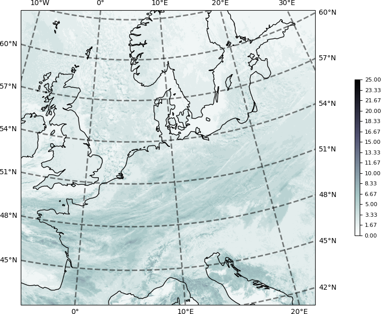

****

Following the CloudCast Tutorial: CloudCast Stereographic (768, 768) based on reprojection and interpolation .

Here is the domain.


<!--  -->

Here we show the associated data.




<!-- Here the data projected to Sterographic are reprojected to Lambert Conformal.


 -->
----

### Mike's Take

The quote "spatial resolution of 928 x 1530 pixels .... where each pixel represents an area of 3×3 km." suggests a simple subset of the non-HRV MSG data.

I assume the longitude subset of 928 rows starts from the northern most row.

    (928*3)/111 = 25.081 deg lat giving 81.1257 - 25.081 = 56.0447.

So 81N to 56N, or using valid data lats

    78.2998 - 25.081 = 53.2188

or 78N to 53N, which is close to 75N to 50N used by Partio et al. (2024).

20W and 45E


Note: the "full_cropped" CloudCast results has the 768x768 resolution. The coordinates are given in projected coordinates not lon/lat.
```
File "2017M01.nc"
File type: Hierarchical Data Format, version 5

netcdf /Users/mbauer/tmp/CloudCast/full_cropped_cloud/2017M01.nc {
  dimensions:
    lat = 768;
    lon = 768;
    time = 2976;
  variables:
    double lat(lat=768);
      :_FillValue = NaN; // double

    double lon(lon=768);
      :_FillValue = NaN; // double

    long time(time=2976);
      :calendar = "proleptic_gregorian";
      :units = "minutes since 2017-01-01 00:09:17";

    ubyte __xarray_dataarray_variable__(lat=768, lon=768, time=2976);

  // global attributes:
}
```


### CloudCast
The dataset has a spatial resolution of 928 x 1530 pixels recorded with 15-min intervals for the period 2017-2018, where each pixel represents an area of 3×3 km.

